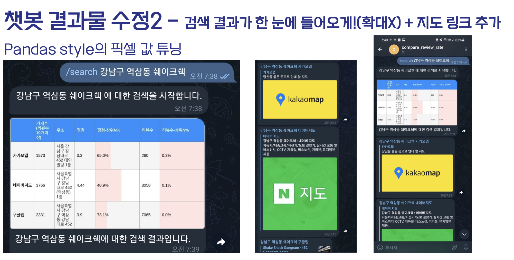

# chatbot-reviewrate-compare

- 다들 맛집을 고를 때 어떤 정보를 참고하시나요?
- 저는 카카오/네이버/구글 세 가지 지도의 평점을 비교해보고 결정합니다.
- 그래서, 위 세 지도의 평점을 한 번에 비교할 수 있으면 편리할 것 같아 챗봇을 개발하게 됐습니다.
- 개발 이전에 데이터 적재 파이프라인을 구축하는 작업을 해봤습니다.

  환경 구축에 참고하시면 될 것 같습니다. [링크](https://github.com/ddongmiin/etl-pipeline-with-gcp)

- 결과물
  

# 발표자료 & 영상링크

- 운이 좋게 데이터야놀자에서 발표를 진행하게 됐습니다.
- [발표자료링크](https://drive.google.com/file/d/1wmQN1vSvriUy5FB6fuDTuFiDaIshBTWG/view?usp=sharing)
- [발표영상링크](https://www.youtube.com/watch?v=9gaS0eJ-nJs)

# 폴더 트리

```Bash
.
├── README.md
├── chat-bot-reviewrate-compare
│   ├── chatbot_server.py
│   ├── googlemap_api.py
│   ├── kakaomap_crawler.py
│   ├── navermap_crawler.py
│   └── roadname_translate.py
└── examples
    ├── naver_crawling.py
    └── start_chatbot
```
